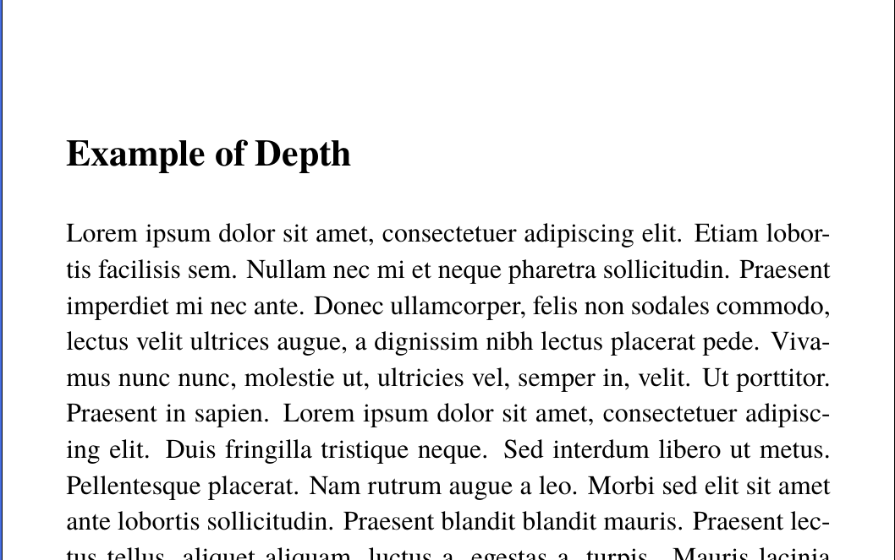
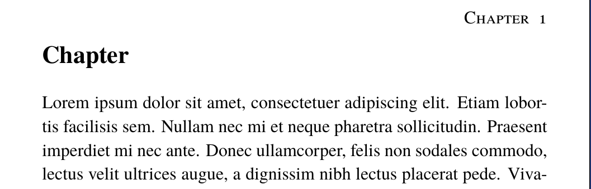
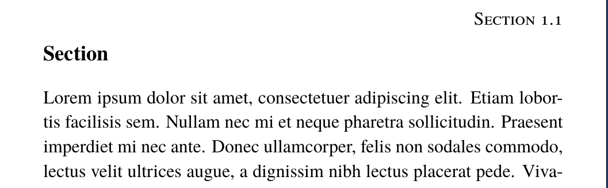

  

# Depth Template
Depth is a simplistic, yet beautiful LaTeX template.

  
  

## [Preview of Ebook](ebook_example.pdf)
## [Preview of Book](book_example.pdf)

## How to use it in your book/e-book
1. Begin by downloading the `.cls` file of your preferred style, which may be `depth_book.cls` or `depth_ebook.cls`
2. Put it in the same folder your main TeX file is in
3. Change your `documentclass` line to `\documentclass{depth_book}` or `\documentclass{depth_ebook}` 